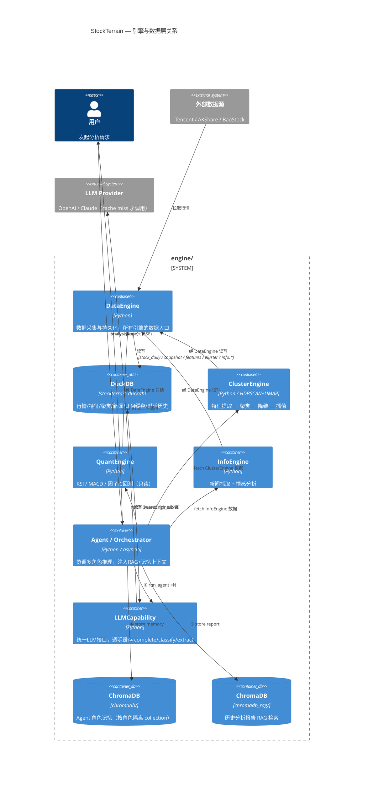
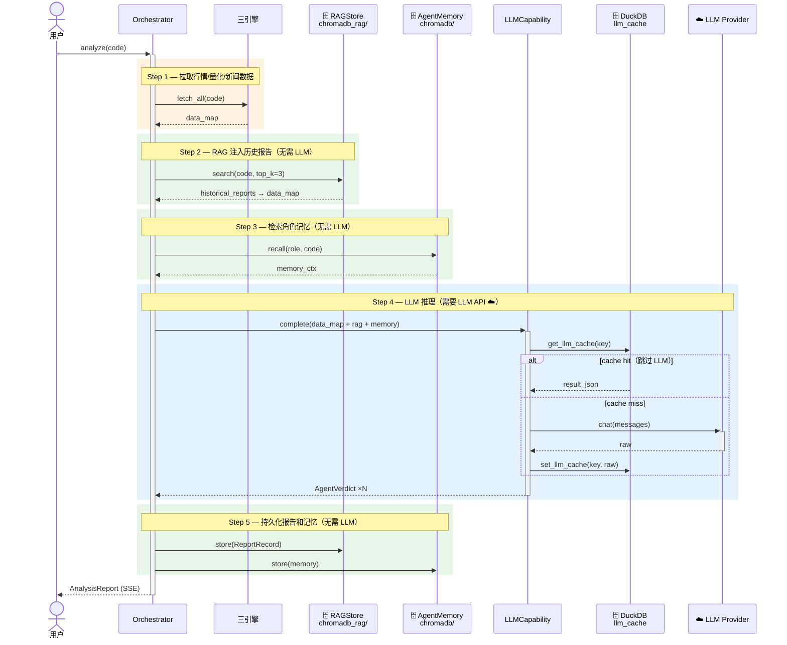

# StockTerrain 数据流向 — 2026-03-14

## 全局数据流

```mermaid
C4Container
    title StockTerrain — 引擎与数据层关系

    Person(user, "用户", "发起分析请求")
    System_Ext(ext, "外部数据源", "Tencent / AKShare / BaoStock")
    System_Ext(llm, "LLM Provider", "OpenAI / Claude（cache miss 才调用）")

    System_Boundary(engine, "engine/") {
        Container(de, "DataEngine", "Python", "数据采集与持久化，所有引擎的数据入口")
        ContainerDb(duckdb, "DuckDB", "stockterrain.duckdb", "行情/特征/聚类/新闻/LLM缓存/对话历史")

        Container(ce, "ClusterEngine", "Python / HDBSCAN+UMAP", "特征提取 → 聚类 → 降维 → 插值")
        Container(qe, "QuantEngine", "Python", "RSI / MACD / 因子IC回测（只读）")
        Container(ie, "InfoEngine", "Python", "新闻抓取 + 情感分析")

        Container(agent, "Agent / Orchestrator", "Python / asyncio", "协调多角色推理，注入RAG+记忆上下文")
        Container(llmc, "LLMCapability", "Python", "统一LLM接口，透明缓存 complete/classify/extract")
        ContainerDb(chroma_mem, "ChromaDB", "chromadb/", "Agent 角色记忆（按角色隔离 collection）")
        ContainerDb(chroma_rag, "ChromaDB", "chromadb_rag/", "历史分析报告 RAG 检索")
    }

    Rel(ext, de, "拉取行情")
    Rel(de, duckdb, "读写", "stock_daily / snapshot / features / cluster / info.*")

    Rel(ce, de, "经 DataEngine 读写")
    Rel(qe, de, "经 DataEngine 只读")
    Rel(ie, de, "经 DataEngine 读写")

    Rel(user, agent, "analyze(code)")
    Rel(agent, ce, "fetch ClusterEngine 数据")
    Rel(agent, qe, "fetch QuantEngine 数据")
    Rel(agent, ie, "fetch InfoEngine 数据")
    Rel(agent, chroma_rag, "② search 注入历史报告")
    Rel(agent, chroma_mem, "③ recall 注入角色记忆")
    Rel(agent, llmc, "④ run_agent ×N")
    BiRel(llmc, duckdb, "读写 shared.llm_cache")
    Rel(llmc, llm, "cache miss 才调用")
    Rel(agent, chroma_rag, "⑤ store report")
    Rel(agent, chroma_mem, "⑥ store memory")
    Rel(agent, user, "AnalysisReport (SSE)")
```

## Agent 单次分析时序

```mermaid
sequenceDiagram
    actor U as 用户
    participant O as Orchestrator
    participant E as 三引擎
    participant RS as 🗄️ RAGStore<br/>chromadb_rag/
    participant AM as 🗄️ AgentMemory<br/>chromadb/
    participant LC as LLMCapability
    participant DB as 🗄️ DuckDB<br/>llm_cache
    participant LLM as ☁️ LLM Provider

    U->>+O: analyze(code)

    rect rgb(255, 243, 224)
        note over O,E: Step 1 — 拉取行情/量化/新闻数据
        O->>E: fetch_all(code)
        E-->>O: data_map
    end

    rect rgb(232, 245, 233)
        note over O,RS: Step 2 — RAG 注入历史报告（无需 LLM）
        O->>RS: search(code, top_k=3)
        RS-->>O: historical_reports → data_map
    end

    rect rgb(232, 245, 233)
        note over O,AM: Step 3 — 检索角色记忆（无需 LLM）
        O->>AM: recall(role, code)
        AM-->>O: memory_ctx
    end

    rect rgb(227, 242, 253)
        note over O,LLM: Step 4 — LLM 推理（需要 LLM API ☁️）
        O->>+LC: complete(data_map + rag + memory)
        LC->>DB: get_llm_cache(key)
        alt cache hit（跳过 LLM）
            DB-->>LC: result_json
        else cache miss
            LC->>+LLM: chat(messages)
            LLM-->>-LC: raw
            LC->>DB: set_llm_cache(key, raw)
        end
        LC-->>-O: AgentVerdict ×N
    end

    rect rgb(232, 245, 233)
        note over O,AM: Step 5 — 持久化报告和记忆（无需 LLM）
        O->>RS: store(ReportRecord)
        O->>AM: store(memory)
    end

    O-->>-U: AnalysisReport (SSE)
```
